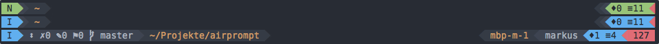

# AirPrompt

AirPrompt is a lightweight, informative prompt in the style of
[powerline](https://github.com/powerline/powerline) or
[vim-airline](https://github.com/vim-airline/vim-airline) for my favorite shell
[zsh](http://zsh.sourceforge.net). I didn't use python, ruby or something
else, it is just a shellscript.



The left and the right prompt is split in segments with different
background-colors. Per default a segment is only shown, if it is useful. For
example the Hostname is shown, if you are working on a remote Host, exactly if
a ssh-connection is established.

I used my command prompt in vi-Modes, so the first segment shows the active
vi-mode, and change the background-color depending on the vi-mode. Like in
vim-airline the statistics segment change the color along with the mode
segment.

The default color-settings needs a terminal with 256 colors. I have testet it
with [iTerm2](http://iterm2.com) on MacOS and the [base16
colorscheme](https://github.com/chriskempson/base16-shell). Not in all
color-schemes the fore- and background colors are the same as in vim, a point
at the ToDo-List.

The Script needs the [Powerline fonts](https://github.com/powerline/fonts).
In my opinion it looks best with DejaVu Sans Mono for Powerline.


## Features

The Segments from left to right are:

 - The VI-Mode
 - git-Information with the number of commits ahead or behind the related
   online repository, the number of untracked files, the number of modified and
   unstaged files and the number of modified and staged files. First I tried
   the vcs_info-plugin of zsh, but it didn't work for me. I get some ideas from
   [Josh
   Dick](http://joshdick.net/2017/06/08/my_git_prompt_for_zsh_revisited.html),
   throw the plugin away, and use the git commands directly.
 - The working directory
 - Hostname
 - Username
 - Statistics with the number of background processes and the number of files
   in the active directory.
 - Returncode of the last statement


## Installation

Install the Script with git:

```shell
git clone https://github.com/sonnmar/airprompt.git ~/.config/zsh/airprompt
```

And add the following statement at the end to your `.zshrc`

```shell
source ~/.config/zsh/airprompt/airprompt.sh
```


## Configuration

You can change the default sequence of prompt segments, if you add an array
named `AP_CONFIG_SECS` to your `.zshrc` in front of the source-statement. The
order of the function-calls in the array arrange the segments from left to
right in the prompt. The function "prs_prompt" defined a pseudo-segment to
split the left from the right prompt and set the fore- and background colors of
the prompt.

```shell
typeset -a AP_CONFIG_SECS
AP_CONFIG_SECS+=('prs_mode 000 004 000 002')    # VI-Mode
AP_CONFIG_SECS+=('prs_git 007 019')             # Git
AP_CONFIG_SECS+=('prs_path 016 018')            # Path
AP_CONFIG_SECS+=('prs_prompt 007 000')          # Prompt
AP_CONFIG_SECS+=('prs_host 016 018')            # Hostname
AP_CONFIG_SECS+=('prs_user 007 019')            # Username
AP_CONFIG_SECS+=('prs_stat 000 l1')             # Statistics
AP_CONFIG_SECS+=('prs_error 000 001')           # Error
```

You can add a new function to your `.zshrc`. The function should handle the
following parameter:
 - first foreground color
 - first background color
 - second foreground color
 - second background color
 - and so on, if you need it.

The return-value should give back a Array with two elements. The first element
is the used background-color and the second element is the string to display in
the prompt-segment with the used foreground colors. An empty string is marked
by a '-'. Here a short function to display the prompt, as an example:

```shell
function prs_path() {
    typeset -a ret
    ret=("$2" "%F{$1} %5~ %f")
    print -l $ret
}
```

The script use the first 22 colors in the 3-digit-notification with %K and %F,
where %K and %k starts and ends the background-color and %F and %f starts and
ends the foreground-color. A simple list of the used colors is shown with:

```shell
for code in {000..021}; do print -P -- "$code: %K{$code}Test%k"; done
```

You can set the background color of a segment (slave)to the background color of
an other segment (master), when you start the color code with an 'l' following
by the number of the master segment in the configuration array. This don't
work, if the function of the slave segment, change the background color itself.


## ToDo

The next steps are:

 - [ ] default coloring for 16 colors
 - [ ] show a nice prompt without powerline fonts
 - [ ] make use of the zsh package managers
 - [ ] detection of vi- or emacs mode
 - [ ] better integration of base16-shell

